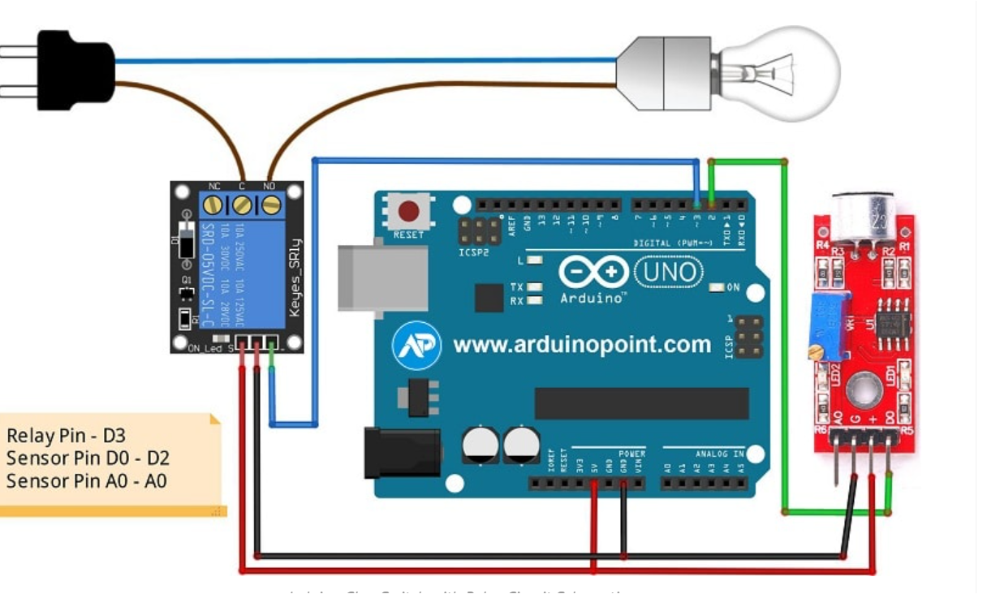

# 👏 Clap-Activated Light Control System 💡

This project demonstrates a basic **sound-based automation system** using an Arduino Uno and a relay module to control an AC bulb via clap detection. The system uses a sound sensor module to register audio spikes (like a clap) and toggles the relay accordingly. It serves as a simple prototype for noise-activated smart control applications in home automation.

---

## 📘 Objective

The objective of this project is to design a low-cost, embedded system that can detect a clap sound and use it to control high-voltage electrical loads, demonstrating the principles of sensor-based switching, signal processing, and relay interfacing in embedded systems.

---

## 🧰 Components

| No. | Component                            | Quantity | Description                                           |
|-----|--------------------------------------|----------|-------------------------------------------------------|
| 1   | Arduino Uno                          | 1        | Main microcontroller for signal processing            |
| 2   | Sound Sensor (KY-038 / LM393)        | 1        | Detects audio signals like claps                      |
| 3   | Relay Module (5V)                    | 1        | Switches an AC bulb via Arduino signal               |
| 4   | AC Bulb + Holder                     | 1        | Load to demonstrate switching                         |
| 5   | Breadboard + Jumper Wires            | Several  | For prototyping and connections                       |
| 6   | LED + 220Ω Resistor (Optional)       | 1        | Used for testing without AC load                      |
| 7   | USB Cable                            | 1        | For Arduino programming                               |

---

## ⚙️ Working Principle

1. The sound sensor continuously monitors environmental noise.
2. When a **clap** is detected (sharp sound spike), it sends a **digital HIGH signal** to Arduino.
3. The Arduino toggles the **relay state**, switching the connected AC bulb **ON or OFF**.
4. The system can also be tested safely using an LED instead of an AC load.

---

## 🔬 Technical Learning Outcomes

- Interfacing sound sensors with Arduino
- Relay control for switching high-voltage devices
- Use of debounce logic for clean input detection
- Prototyping basic automation systems using microcontrollers

---

## 🛠 Future Enhancements

- Add **clap pattern recognition** (e.g., double or triple clap)
- Introduce a **timer circuit** for auto-off function
- Add **Bluetooth/Wi-Fi module** for remote override
- Use **optocouplers** for improved isolation and safety

---

## 🖼️ Circuit Diagram

> Replace the image below with your circuit diagram.

---

## ⚠️ Safety Notice

This project includes an AC load. When working with relays and 220V:
- Ensure proper insulation and terminal protection
- Avoid handling live wires directly
- Use safety gloves and isolate circuits before uploading new code

---

## 👨‍💻 Author

**Aliyan Hassan**  
Electrical Engineering Department  
GIFT University, Gujranwala, Pakistan  
GitHub: [@aliyan-hassan](https://github.com/aliyan-hassan)  
Email: [aliyank7171@gmail.com](mailto:aliyank7171@gmail.com)

---

